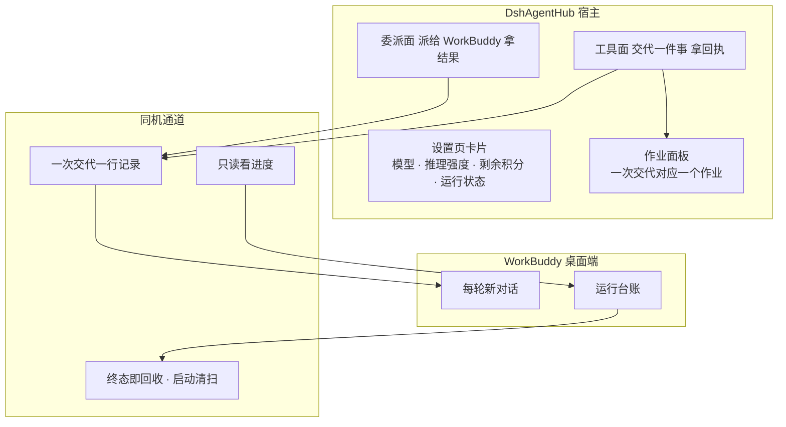

# DshAgentHub

DshAgentHub 把本机 agent（首个 WorkBuddy）变成看得见、可调度、可观测的执行方。全程同机，不跨网。

---

## 交代的事，两边各留一样东西

交代的事在WorkBuddy里是一条对话，在DshAgentHub里是一条回执。

---

## 能力

| 能力 | 说明 |
|---|---|
| 下发任务 | `workbuddy_run` 交代一件事，DshAgentHub 作业面板里有一个对应的作业。 |
| 多轮归组 | 同 `session_key` 可二次下发，每轮都是新对话。 |
| 模型与推理强度 | 下发时可选模型与推理强度（6 档），都不指定时按最省的兜底，实际用了哪个以回执为准。 |
| 积分只读显示 | 设置卡片上有一行「剩余积分」，只读展示，读不到就明说读不到。 |
| 启动清理 | 插件启动时回收上一次遗留的下发记录，不留会自己再跑的活任务。 |

---

## 非目标

- 不做 CLI 控制：不自己拉起任何 agent 进程下发任务；
- 不做网关反代理：不把 WorkBuddy 冒充成 DshAgentHub 的一台模型，不重托管任何模型路由；
- 不做 GUI 自动化：不模拟点击，不读界面像素；
- 不跨网：状态接口只接受本机请求，任务数据不出这台机器。

---

## 架构



两个入口，一条通道：工具面在作业面板里留一个作业，委派面在父会话里留那一次调用与它返回的结果。

---

## 安装

### 前置

| 条件 | 说明 |
|---|---|
| Node.js **≥ 22.5.0** | 见 `package.json` 的 `engines` |
| WorkBuddy **桌面端** | 必须**已启动并已登录** —— 插件借用它的登录态，自己不持有任何账号凭据 |
| DshAgentHub（核心为 DeepSeek Harness / dsh） | 插件以 DshAgentHub 插件的形式装载 |

### 步骤

```powershell
git clone https://github.com/Zoupidan/dsh-control-plane.git
cd dsh-control-plane

node -v                 # 确认 >= 22.5.0

# 把插件包的 @deepseek-ai/* 依赖指向本机 DshAgentHub 安装体（Windows 上是目录 junction）
npm run link:dsh-deps
```

`npm run link:dsh-deps` 需要本机已经装过 DshAgentHub，且**重复跑安全**。

装载进你的 DshAgentHub profile 之后，**重启 DshAgentHub** 才生效（插件代码在宿主启动时装载）。改完源码同样重启才生效。

---

## 使用

工具只暴露给主控模型（`workbuddy_run` / `workbuddy_status`）。调不调用由 LLM 自主决定，人在 DshAgentHub 里只管交代事。总开关决定是否启用：关则零下发，不往桌面端写任何东西。

---

## 设置卡片

设置页里 WorkBuddy 那张卡片（DshAgentHub 插件）显示四样东西：**模型与倍率**、**推理强度档位**、**剩余积分**、**运行状态**。

- 模型后面带倍率标注（如 `x0.51`）；没有倍率的显示"倍率未知"，仍然可选；
- 推理强度档位来自桌面端的实际能力表，标注哪些可选、哪些置灰；
- 积分读不到时显示"暂时读不到"，不显示为 `0`。

---

## 状态接口

同一份数据也能从本机状态接口读到（**只接受本机请求**，非本机来源返回 403）：

```powershell
$DSH_WEB = 'http://127.0.0.1:19387'   # ← 换成你 DshAgentHub Web 的端口

$s = (Invoke-WebRequest -UseBasicParsing -Uri "$DSH_WEB/plugin-workbuddy/status").Content | ConvertFrom-Json

"registry        = $($s.registry)"
"modelsSource    = $($s.modelsSource)"
"models.count    = $($s.models.Count)"
"credits.ok      = $($s.credits.ok)  remain=$($s.credits.remain)"
```

`modelsSource` 以 `desktop-live:` 开头表示目录与倍率来自桌面端实时接口；以 `desktop-cache:` 开头表示已回落到本地缓存，目录可能偏少、倍率可能过期。

积分只在这个接口的 `credits` 字段里，`workbuddy_status` 工具输出里没有，去工具面找不到不是问题。

---

## 发布

当前版本 `0.1.0`（见 `package.json`）。版本号遵循 SemVer；验收以回执与桌面端对话为准：交代的事在 WorkBuddy 里是一条对话，在 DshAgentHub 里是一条回执。

---

## 已知限制

- **推理强度以桌面端的实际口径为准**。插件保证把选定的档位写进下发请求，能否生效由桌面端决定，实际生效情况以回执为准。
- **同一归组键可二次下发，每轮都是新对话**。新任务换新键便于区分。
- **积分有结算延迟**（约一分钟），读数自带新鲜度标注；刚跑完立刻读到的可能是旧值。
- 只在 Windows 上验证过；跨平台未验证。
- 活动区为 ESM JS，不做类型检查；测试状态以 CI 输出为准。

---

## 安全边界

- **自建自回收**：插件只写自己建的一次性下发记录，终态（成功/失败/超时/取消）一律回收，启动时再扫一遍遗留，不留会自己再跑的活任务；
- **凭据不回显**：插件不持有、不存储、不回显任何账号凭据，凭据不进日志、作业输出与错误文案，仓库有机器门禁守这条；
- **测试护栏**：跑测试必须带护栏（`node --import ./tools/dev/test-home-guard.mjs`），绕过护栏的测试可能写进真实数据。

---

## 贡献与许可

欢迎提 issue。[MIT](./LICENSE)。安全问题不要开公开 issue，请走 GitHub 私有漏洞报告（仓库页面 → Security → Report a vulnerability）。
